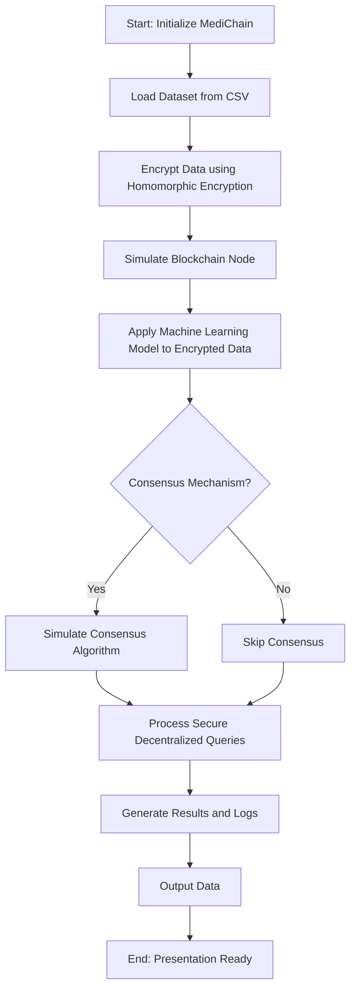

### flowchart




### Description of Each Step:
1. **Load Dataset**:
   - Determine if you're using a CSV file or MySQL database as the input source.
2. **Encrypt Data**:
   - Apply homomorphic encryption to protect the data.
3. **Simulate Blockchain**:
   - Implement a blockchain-like structure where nodes process the data.
4. **Apply ML Model**:
   - Use the encrypted data for predictions or analysis with your ML model.
5. **Consensus Mechanism**:
   - Simulate a simple consensus if multiple nodes are involved.
6. **Process Queries**:
   - Demonstrate how queries are handled securely and decentralized.
7. **Output Results**:
   - Present the processed data and insights while maintaining encryption integrity.


---
### directories for backend

root/
│
├── backend/
│   ├── data/
│   │   ├── dataset.csv           # The main CSV file containing patient data
│   │   ├── encrypted_data.csv    # Encrypted version of the dataset
│   │   └── results.csv           # Results generated by the system
│   │
│   ├── encryption/
│   │   ├── homomorphic.py        # Functions for homomorphic encryption and decryption
│   │   └── __init__.py           # Marks the folder as a Python module
│   │
│   ├── blockchain/
│   │   ├── blockchain.py         # Blockchain structure and functionality
│   │   ├── consensus.py          # Simulated consensus algorithm
│   │   └── __init__.py           # Marks the folder as a Python module
│   │
│   ├── ml_model/
│   │   ├── model.pkl             # Serialized machine learning model (optional)
│   │   ├── ml_pipeline.py        # Code to preprocess data and make predictions
│   │   └── __init__.py           # Marks the folder as a Python module
│   │
│   ├── main.py                   # Entry point for running the backend system
│   ├── config.py                 # Configuration file for parameters (e.g., file paths)
│   ├── utils.py                  # Utility functions shared across modules
│   └── requirements.txt          # Python dependencies
│
├── frontend/
│   ├── static/                   # CSS, JavaScript, images
│   ├── templates/                # HTML files for rendering
│   ├── app.py                    # Backend integration with frontend (Flask/Django)
│   ├── routes.py                 # Defines frontend-backend API endpoints
│   └── requirements.txt          # Frontend-specific dependencies
│
├── README.md                     # Project documentation
└── .gitignore                    # Ignore unnecessary files in version control

---


# MediChain: Blockchain-Based Patient Data Repository

MediChain is a blockchain-inspired system designed for securely managing patient data with homomorphic encryption and decentralized queries. This project processes a dataset, encrypts the data, stores it in a simulated blockchain, and uses machine learning models for secure predictions.

---

## Backend Development Workflow

This document outlines the step-by-step process to implement and integrate the backend components of MediChain.

---

### 1. **Data Preparation**
**Objective**: Set up and preprocess the dataset for further processing.

- Place the dataset in the `backend/data/` directory (e.g., `dataset.csv`).
- Write utility functions in `utils.py` to:
  - Load the dataset as a Pandas DataFrame.
  - Save processed data back to a CSV file.
- Optionally clean and preprocess the dataset (e.g., handle missing values, normalize fields).

---

### 2. **Encryption Module**
**Objective**: Implement homomorphic encryption to secure patient data.

- **Tasks**:
  1. Install a homomorphic encryption library (e.g., `phe` or `PySEAL`).
  2. Create the following functions in `backend/encryption/homomorphic.py`:
     - `encrypt_data(data)`: Encrypt the entire dataset.
     - `decrypt_data(data)`: Decrypt the dataset for validation.
     - `process_encrypted_data(data)`: Perform computations directly on encrypted data (e.g., summation or model inference).
  3. Test the encryption and decryption using sample data.

---

### 3. **Machine Learning Model**
**Objective**: Train and prepare the machine learning model for encrypted predictions.

- **Tasks**:
  1. Use a Jupyter Notebook (`ml_pipeline.ipynb`) to:
     - Preprocess the dataset (e.g., feature scaling, encoding categorical variables).
     - Train a model (e.g., Random Forest, Logistic Regression).
     - Evaluate the model (e.g., accuracy, confusion matrix).
  2. Serialize the trained model as `model.joblib` using `joblib`.
  3. Write a script in `ml_pipeline.py` to:
     - Load the trained model.
     - Preprocess encrypted data for predictions.
     - Use the model to make predictions on encrypted data.

---

### 4. **Blockchain Module**
**Objective**: Simulate blockchain behavior for secure and decentralized data management.

- **Tasks**:
  1. Implement the blockchain structure in `backend/blockchain/blockchain.py`:
     - Create a `Block` class with attributes like `index`, `timestamp`, `data`, `hash`, and `previous_hash`.
     - Create a `Blockchain` class to manage the chain, add blocks, and validate the chain.
  2. Write a function to add encrypted data as transactions to the blockchain.
  3. Implement a basic consensus algorithm in `backend/blockchain/consensus.py` (optional for single-node systems).

---

### 5. **Backend Workflow Integration**
**Objective**: Integrate all components into a unified backend pipeline.

- **Tasks**:
  1. Write the main entry script in `main.py`:
     - Load the dataset using utility functions.
     - Encrypt the data using `encrypt_data()`.
     - Add encrypted data to the blockchain.
     - Use the ML model to make predictions on the encrypted data.
     - Decrypt and save the results to `results.csv`.
  2. Test the entire pipeline to ensure all modules work together.

---

### 6. **Testing and Debugging**
**Objective**: Ensure the system works seamlessly and identify any issues.

- **Tasks**:
  - Write unit tests for each module (encryption, ML, blockchain).
  - Write integration tests for the full pipeline in `main.py`.

---

### 7. **Documentation**
**Objective**: Provide clear and concise documentation for the backend system.

- **Tasks**:
  - Add comments and docstrings to all modules and scripts.
  - Update this `README.md` with:
    - Project overview.
    - Instructions for running the backend.
    - Description of each module and its purpose.
    - Example outputs or screenshots.

---

## Running the Backend

1. **Install Dependencies**:
   ```bash
   pip install -r backend/requirements.txt

---
### Updated Backend Workflow with MySQL

#### 1. **Data Preparation**
**Objective**: Replace CSV-based storage with MySQL.

**Implementation**:
   - Use MySQL to store the dataset. Create a `disease_data` table that mirrors the structure of your CSV file.
   - Write a Python script (`data_utils.py`) to:
      - Connect to the MySQL database using `mysql-connector-python` or `SQLAlchemy`.
      - Load data from MySQL into a Pandas DataFrame.
      - Save processed data back to the MySQL database.

#### 2. **Encryption Module**
**Objective**: Secure patient data while utilizing MySQL for storage.

**Implementation**:
   - Store encrypted data in the MySQL database:
      - Encrypt sensitive fields (e.g., symptoms and outcomes) before inserting into the database.
   - Write utility functions (`homomorphic_mysql.py`) to:
      - Encrypt data before `INSERT`.
      - Decrypt data after `SELECT`.

#### 3. **Machine Learning Model**
**Objective**: Use data from MySQL for model training and predictions.

**Implementation**:
   - Modify `ml_pipeline.py` to:
      - Fetch training data from MySQL.
      - Process and train the model as before.
      - Save predictions back into the `disease_data` table (e.g., adding a `Predicted_Outcome` column).

#### 4. **Blockchain Module**
**Objective**: Use MySQL as a transaction log for blockchain records.

**Implementation**:
   - Store each transaction (e.g., encrypted symptom records) as a block in a `blockchain` table:
      - Fields: `block_id`, `timestamp`, `data`, `previous_hash`, `current_hash`.
   - Add functions in `blockchain.py` to:
      - Retrieve blockchain data from MySQL.
      - Validate and append new blocks to the chain.
      - Persist the updated chain back to MySQL.

#### 5. **Backend Workflow Integration**
**Objective**: Connect all modules using MySQL as the central hub.

**Implementation**:
   - Update `main.py`:
      - Fetch data from the `disease_data` table.
      - Encrypt sensitive fields and insert into the `blockchain` table.
      - Use the ML model to predict outcomes on encrypted data.
      - Store predictions back into the `disease_data` table.
      - Provide endpoints (via Flask/Django) for the admin to view or add new data.


"""
import mysql.connector

# Database connection
db = mysql.connector.connect(
    host="localhost",
    user="your_username",
    password="your_password",
    database="medichain_db"
)

cursor = db.cursor()

# 1. Create
def insert_data():
    sql = """
    INSERT INTO disease_data (
        Disease, Gender, Fever, Cough, Fatigue, Difficulty_Breathing, Age, Blood_Pressure, Cholesterol_Level, Outcome_Variable, Predicted_Outcome
    ) VALUES (
        %s, %s, %s, %s, %s, %s, %s, %s, %s, %s, %s
    );
    """
    values = ('Influenza', 'Female', 'Yes', 'No', 'Yes', 'Yes', 19, 'Low', 'Normal', 'Positive', None)
    cursor.execute(sql, values)
    db.commit()
    print(f"Inserted ID: {cursor.lastrowid}")

# 2. Read
def fetch_data():
    cursor.execute("SELECT * FROM disease_data;")
    records = cursor.fetchall()
    for record in records:
        print(record)

# 3. Update
def update_data():
    sql = "UPDATE disease_data SET Predicted_Outcome = %s WHERE id = %s;"
    values = ('Positive', 1)
    cursor.execute(sql, values)
    db.commit()
    print(f"Updated rows: {cursor.rowcount}")

# 4. Delete
def delete_data():
    sql = "DELETE FROM disease_data WHERE id = %s;"
    value = (2,)
    cursor.execute(sql, value)
    db.commit()
    print(f"Deleted rows: {cursor.rowcount}")

# Call functions
insert_data()
fetch_data()
update_data()
delete_data()

cursor.close()
db.close()


"""


algorithm

checking and adding in the database:
adding new data in dataset check the final count in the id + 1 (for new data)
id of the new data, pointing to the new data index(id) then append the prediction of the model

blockchain:
append the block attributes in the table of blockchain in the database.


1. disease_data
This table stores the primary dataset containing patient symptoms and associated predictions.

Columns:

id (INT, Primary Key, Auto Increment)
Disease (VARCHAR(50))
Gender (VARCHAR(10))
Fever (VARCHAR(3))
Cough (VARCHAR(3))
Fatigue (VARCHAR(3))
Difficulty_Breathing (VARCHAR(3))
Age (INT)
Blood_Pressure (VARCHAR(20))
Cholesterol_Level (VARCHAR(20))
Outcome_Variable (VARCHAR(20)) – The actual disease status (e.g., Positive/Negative)
Predicted_Outcome (VARCHAR(20), nullable) – The prediction result by the ML model.


2. users
This table manages admin and medical personnel access to the system.

Columns:

user_id (INT, Primary Key, Auto Increment)
username (VARCHAR(50), Unique)
password (VARCHAR(255)) – Store encrypted passwords.
role (VARCHAR(20)) – Admin or Medical Personnel.


3. blockchain
This table simulates the blockchain by storing data in blocks.

Columns:

block_id (INT, Primary Key, Auto Increment)
timestamp (DATETIME) – When the block was added.
data (TEXT) – Encrypted data (e.g., patient symptoms and results).
previous_hash (VARCHAR(255)) – Hash of the previous block.
current_hash (VARCHAR(255)) – Hash of this block.


4. logs
This table tracks actions performed by users for auditing and monitoring purposes.

Columns:

log_id (INT, Primary Key, Auto Increment)
user_id (INT, Foreign Key referencing users.user_id)
action (VARCHAR(255)) – Description of the action (e.g., "Added new data", "Updated prediction").
timestamp (DATETIME)


5. model_performance
This table stores metadata about the machine learning model and its performance metrics for tracking and debugging.

Columns:

model_id (INT, Primary Key, Auto Increment)
model_name (VARCHAR(50)) – e.g., "Random Forest"
accuracy (FLOAT)
precision (FLOAT)
recall (FLOAT)
timestamp (DATETIME) – When the model was last updated.
Summary of Relationships:
disease_data is the central table storing input data and prediction results.
blockchain tracks changes in encrypted form for decentralization and security.
users and logs ensure system accountability.
model_performance helps monitor ML model updates and performance.


TODO:
Check the connection of blockchain and the consensus
API connection to the Frontend